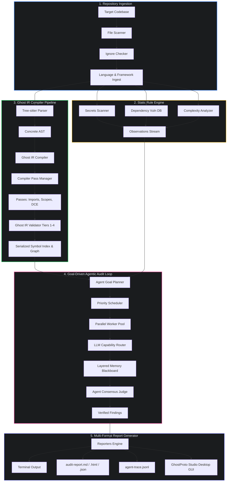
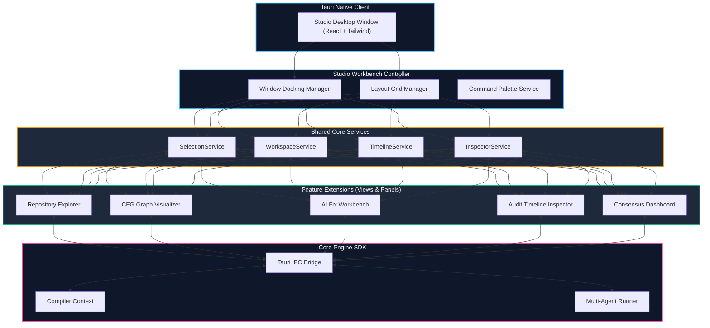

<div align="center">

# GhostProto

**AI-Powered Codebase Auditor**

*One command. Complete audit. Powered by Proto Engine.*

[](LICENSE)
[](https://nodejs.org)
[](https://github.com/AtlasRoX/Ghost-Proto)

</div>

---

## What is GhostProto?

**GhostProto** is a zero-config, AI-powered codebase auditor that runs via `npx ghostproto` (or globally as `ghostch`) to generate comprehensive, professional-grade codebase audit reports.

It bridges the gap between deterministic compiler analysis (ASTs, call graphs, taint analysis) and probabilistic AI reasoning. GhostProto combines fast static analysis with a multi-agentic review loop that executes tools, traces control flow, validates hypotheses, and verifies findings with concrete evidence.

---

## Key Features & Audit Dimensions

GhostProto audits your codebase across **7 core dimensions**:

| Category | Description & Verifications |
|:---|:---|
| 🔒 **Security** | Hardcoded secrets, SQL injection, XSS vulnerabilities, unsafe cryptographic functions, authentication flow flaws. |
| ✨ **Code Quality** | Deep nesting, cyclomatic complexity spikes, code duplication, dead code, and naming anti-patterns. |
| ⚡ **Performance** | N+1 query patterns, synchronous blocking I/O, potential memory leaks, and inefficient algorithms. |
| 🏗️ **Architecture** | Modularity violations, separation of concerns, high coupling, circular dependencies, and scalability. |
| 📦 **Dependencies** | Outdated or deprecated packages, known CVE vulnerabilities, dependency bloat, and license risks. |
| 🧪 **Testing** | Coverage gaps, missing test boundaries, flaky test patterns, and low test assertions quality. |
| 📝 **Documentation** | API endpoint documentation gaps, missing JSDoc/docstrings, and stale code comments. |

---

## System Architecture

GhostProto consists of two major components: the **Analysis & Compiler Pipeline** (the core engine) and **GhostProto Studio** (the desktop-grade UI client).

### 1. Analysis & Compiler Pipeline
This pipeline processes files, generates AST structures, compiles code into a language-neutral intermediate representation (Ghost IR), and coordinates the multi-agent reasoning loop.



### 2. GhostProto Studio (Workbench Architecture)
The desktop application GUI encapsulates the engine's core SDK behind a modular workbench environment communicating via Tauri IPC.



---

## Three Analysis Modes

Depending on requirements, GhostProto can be executed in three modes:

| Mode | Command Flag | Execution Details |
|:---|:---|:---|
| **Static Mode** | `--static` | Runs completely offline with no LLM dependency. Evaluates AST-pattern rules, dependency files, and code complexity metrics. |
| **One-shot AI Mode** | `--fast` | Fast and cost-efficient. Sends a compressed code digest to the Proto Engine for a single-pass AI review. |
| **Agentic Mode** | *(Default when API key set)* | Spin up a multi-agent loop. The agents analyze findings, formulate security hypotheses, call file tools, explore code structures, and verify issues before outputting them. |

---

## Installation & Setup

### Requirements
- **Node.js** >= 18.0.0
- **npm** >= 8.0.0
- **Git** installed on the local system path

### 1. Global Installation (NPM)
Install the package globally via npm:
```bash
npm install -g ghostproto
```

### 2. Windows PowerShell (One-Click Installer)
Run this command in an elevated PowerShell terminal to automatically verify dependencies, fetch the project source, and install the `ghostch` CLI globally:
```powershell
Set-ExecutionPolicy Bypass -Scope Process -Force; [System.Net.ServicePointManager]::SecurityProtocol = [System.Net.ServicePointManager]::SecurityProtocol -bor 3072; iex ((New-Object System.Net.WebClient).DownloadString('https://raw.githubusercontent.com/AtlasRoX/Ghost-Proto/main/install.ps1'))
```

### 3. Local Development Setup
To build the application locally from source:
```bash
# Clone the repository
git clone https://github.com/AtlasRoX/Ghost-Proto.git
cd Ghost-Proto

# Install packages
npm install

# Compile TypeScript
npm run build
```

---

## Usage Guide

Run audits on your current directory or target project path:

### Standard CLI Audits
```bash
# Zero-Install audit (defaulting to agentic mode if API key is in environment)
GHOSTPROTO_API_KEY=your_api_key_here npx ghostproto

# Fast one-shot AI review on a specific project directory
ghostch --fast ./my-project-path

# Pure static analysis (does not require API key)
ghostch --static
```

### Interactive Terminal Dashboard
Launch the interactive CLI dashboard using the `-i` / `--interactive` flag:
```bash
ghostch -i ./my-saas-app
```

### Configuration Management
Store your API key globally or view configuration flags using the `config` subcommand:
```bash
# Set your API key globally
ghostch config set apiKey nvapi-xxxxxxxxxxxxxxxx

# Set the default LLM model
ghostch config set model 0.3

# Display active configuration profile and settings file path
ghostch config show
```

### Trace Artifacts
Every agentic run generates a chronological trace file under `.ghostproto/agent-trace.jsonl`:
```jsonl
{"kind":"meta","model":"0.3","maxTurns":25,"maxBudgetTokens":500000,"summary":{}}
{"kind":"call","turn":1,"toolUseId":"call_abc123","name":"get_project_summary","input":{},"isError":false}
{"kind":"call","turn":2,"toolUseId":"call_def456","name":"search_code","input":{"pattern":"eval("},"isError":false}
```

---

## Options Reference

```text
Usage: ghostch [options] [path]

Arguments:
  path                      Path to the project to audit (default: ".")

Options:
  -v, --version             Output version
  -k, --api-key <key>       Proto API key (or set GHOSTPROTO_API_KEY)
  -o, --output <formats>    Output formats: terminal,markdown,html,json (default: "terminal,markdown,html")
  -c, --categories <cats>   Audit specific categories only (e.g. security,quality)
  -m, --model <model>       Proto model (default: "0.3")
  --max-files <n>           Max files to scan (default: 500)
  --max-file-size <kb>      Max file size in KB (default: 100)
  --static                  Static analysis only (no AI)
  --fast                    One-shot AI mode (no agentic loop)
  -i, --interactive         Run interactive terminal dashboard
  --max-turns <n>           Agentic iteration cap (default: 25)
  --max-budget <tokens>     Agentic token ceiling (default: 500000)
  --no-trace                Don't write agent-trace.jsonl
  -V, --verbose             Show per-turn token spend, tool durations, and result previews
  --output-dir <dir>        Directory for report files (default: .ghostproto/)
  -q, --quiet               Suppress progress output
  --json                    Output JSON to stdout (CI/CD mode)
  -h, --help                Display help
```

---

## Supported Ecosystems
GhostProto supports syntactical parsing and analysis across a wide range of languages:

- **Web:** TypeScript, JavaScript, Vue, Svelte, Astro, HTML, CSS.
- **Backend & Systems:** Python, Go, Rust, Java, Kotlin, Swift, C/C++, C#, PHP, Ruby, Scala, Elixir, Haskell, Lua, R.
- **Data & Configuration:** SQL, Shell scripts, YAML, Terraform, Dockerfile.

---

## Exit Codes

The CLI emits standardized exit codes for CI/CD integrations:

| Exit Code | Classification | Meaning |
|:---:|:---|:---|
| `0` | Success | Audit completed and passed; no critical issues found. |
| `1` | Alert | Audit completed; one or more critical issues detected. |
| `2` | Error | Audit execution failed due to errors or configurations. |

---

## Developer Commands

Run developer scripts from the repository root:

```bash
# Start in development environment via ts-node
npm run dev -- ./path/to/target

# Perform type checking
npm run typecheck

# Run unit tests
npm test

# Run tests and generate code coverage report
npm run test:coverage
```

---

## License

MIT © [AtlasRoX](https://github.com/AtlasRoX)
